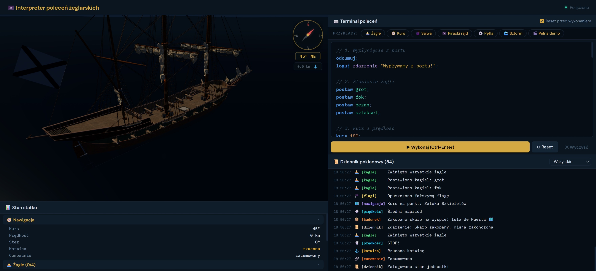

# Pirate Ship Command Interpreter

A Polish-language pirate ship command interpreter with ANTLR4 backend, React frontend, and Three.js 3D visualization.



### Start Backend
```bash
uvicorn app:app --reload --port 8000
```

### Start Frontend
```bash
npm run dev
```

The application will be available at `http://localhost:5173`
